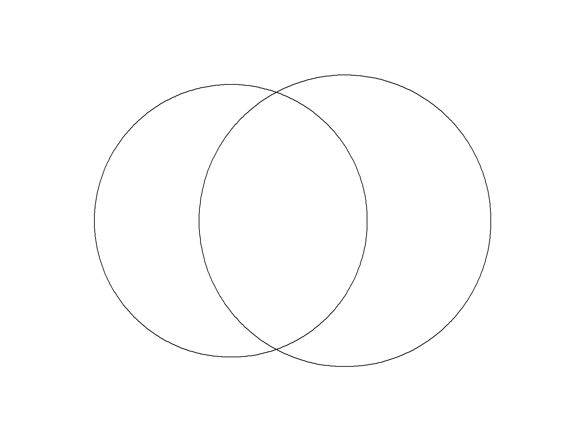

# vennvis: Visualise Variable Relations using Venn Diagrams

It's simple: the area of each circle is proportional to a variable's variance, the overlap is proportional to their covariance. 

```r
devtools::install_github("vankesteren/vennvis")
```

# Example

```r
vennvis(iris$Sepal.Width, iris$Petal.Width)
```


