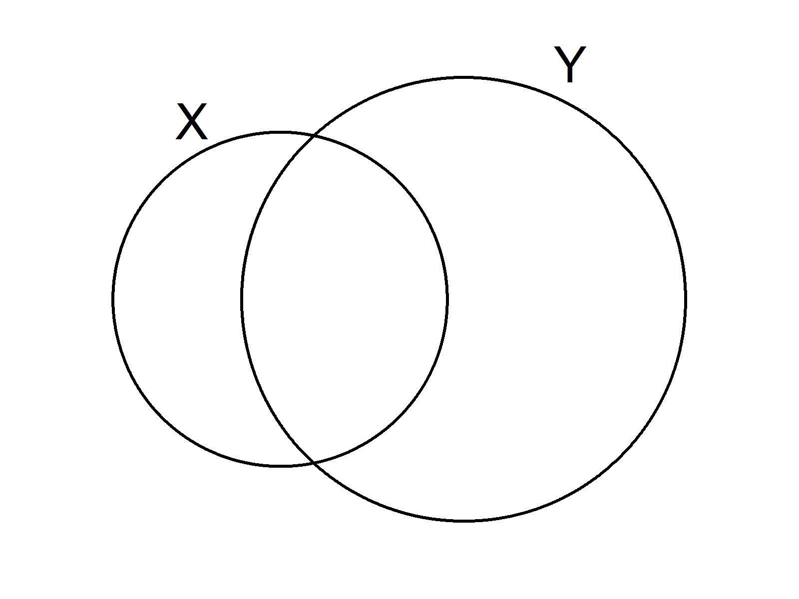

# vennvis: venn visualisation of variable variances

[](https://travis-ci.org/vankesteren/vennvis)

It's simple: the area of each circle is proportional to a variable's variance, the overlap is proportional to their covariance. 

```r
devtools::install_github("vankesteren/vennvis")
```

# Example

```r
set.seed(147289)
x <- rnorm(100)
y <- 0.5*x+rnorm(100, 0.25)
vennvis(x, y)
```

<p align="center"></img></p>

```r
z <- 0.3*x+0.4*y+rnorm(100, 0.15)
vennvis(x, y, z)
```
<p align="center"></img></p>


# Ok cool, what's next?

Visual upgrades are on their way. Also, variable labels might be nice. Much to do. If you're interested in contributing, don't hesitate to fork, clone, or pull request. Any tips welcome!
